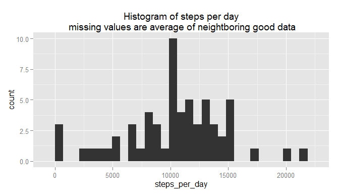

# Reproducible Research: Peer Assessment 1
HowlinHank  
August 16, 2015  

This work is for the Peer Assessment 1 for the Aug 2015 Reproducible Research class taught by
Roger Peng as part of Coursera's Data Science Specialization.

The data for this exercise is taken from the assignment github repository but can also be found at [link](https://d396qusza40orc.cloudfront.net/repdata%2Fdata%2Factivity.zip)

The setup for this work is given in the appendix at the end of this document.

The work will use dplyr and ggplot2. Loading these silently.

Figures that are created will be stored in the figure directory in png format at 600x600
resolution.


```
## 
## Attaching package: 'dplyr'
## 
## The following objects are masked from 'package:stats':
## 
##     filter, lag
## 
## The following objects are masked from 'package:base':
## 
##     intersect, setdiff, setequal, union
```

## Loading and preprocessing the data ======================

Check the activity.csv file to see whether it has a header and what separator it uses


```r
setwd("~/rdata/ReproRes-Proj1/RepData_PeerAssessment1") 
figdir <- "~/rdata/ReproRes-Proj1/RepData_PeerAssessment1/figures/"
readLines("activity.csv", n=4)
```

```
## [1] "\"steps\",\"date\",\"interval\"" "NA,\"2012-10-01\",0"            
## [3] "NA,\"2012-10-01\",5"             "NA,\"2012-10-01\",10"
```

The data was loaded from the local file system and stored in a data frame. I will convert the date
field to a Date format.


```r
cls <- c("steps"="numeric", "date"="character", "interval"="numeric")
rawdata <-read.csv("activity.csv", header=TRUE, colClasses=cls)
rawdata$date <- as.Date(rawdata$date, "%Y-%m-%d")
str(rawdata)
```

```
## 'data.frame':	17568 obs. of  3 variables:
##  $ steps   : num  NA NA NA NA NA NA NA NA NA NA ...
##  $ date    : Date, format: "2012-10-01" "2012-10-01" ...
##  $ interval: num  0 5 10 15 20 25 30 35 40 45 ...
```


## What is mean total number of steps taken per day? =========


```r
steps_per_day <- rawdata %>% group_by(date) %>% summarize(steps_per_day= sum(steps))
filename <- "1_steps_per_day_hist.png"
steps_per_day_fig <- paste(figdir, filename, sep="")
png(filename = steps_per_day_fig, width=600, height=600)
g <-qplot(data=steps_per_day, steps_per_day, geom="histogram")
g
```

```
## stat_bin: binwidth defaulted to range/30. Use 'binwidth = x' to adjust this.
```

```r
dev.off()
```

```
## png 
##   2
```

```r
g
```

```
## stat_bin: binwidth defaulted to range/30. Use 'binwidth = x' to adjust this.
```

 

```r
mean_day <- mean(steps_per_day$steps_per_day, na.rm=TRUE)
median_day <- median(steps_per_day$steps_per_day, na.rm=TRUE)
```

### Results -------------------------------
The mean steps per day = **1.0766189\times 10^{4}**

The median steps per day = **1.0765\times 10^{4}**

The histogram is stored in the file: **figures/1_steps_per_day_hist.png**


## What is the average daily activity pattern? ================


```r
int_steps <- rawdata %>% group_by(interval) %>% summarise(daily_ave = mean(steps, na.rm=TRUE))
filename <- "2_ave_daily.png"
ave_daily_fig <- paste(figdir, filename, sep="")
png(filename = ave_daily_fig, width=600, height=600)
g <- qplot(interval, daily_ave, data=int_steps, geom="bar", stat="identity", 
           color="red", fill = "red") +
    xlab("5 minute intervals throughout day") + ylab("Average daily steps") +
    ggtitle("Average daily steps per 5 min interval")
g
dev.off()
```

```
## png 
##   2
```

```r
g
```

 

```r
max_steps <- max(int_steps$daily_ave)
max_day <- which.max(int_steps$daily_ave)
hour <- trunc(max_day/12)
min <- (max_day * 5) %% 60
```

###Results ------------
The maximum number of steps is: **206.1698113**

Which happens at interval: **104**  or Hour= **8**, Minute = **40**

The graph is stored in the file: **figures/2_ave_daily.png**

## Imputing missing values ================

After looking over the data, it was decided that the best way to impute the missing values was to take the average of the leading and trailing good data around a missing day. (The NA's are
complete for full days, no partials.) For contiguous missing data, it skips until it finds the
next good data. Should the first and last data be missing (they are), then the function will use the same value of the closest good data.


```r
na_vector <- is.na(rawdata$steps)
na_cnt <- sum(na_vector)
na_days <- rawdata[na_vector, ]
na_dist <- na_days %>% group_by(date) %>% summarize(count=n())
na_dist
```

```
## Source: local data frame [8 x 2]
## 
##         date count
## 1 2012-10-01   288
## 2 2012-10-08   288
## 3 2012-11-01   288
## 4 2012-11-04   288
## 5 2012-11-09   288
## 6 2012-11-10   288
## 7 2012-11-14   288
## 8 2012-11-30   288
```

```r
tot_days <- rawdata %>% group_by(date) %>% summarize(count=sum(steps))
tot_na_days <- nrow(na_dist)

imp_steps_per_day <- steps_per_day
impute_steps <- function(x=imp_steps_per_day$steps_per_day) {
    max_row <- length(x)
    last_val <- NA
    prior_na <- FALSE
    val <- NA
    for(i in 1:max_row) {
        val <- x[i]
        if(!is.na(val)) {
            last_val <- val
            next
        }
    
#any NA will be replaced with average of good values prior and past the hole
#first and last NA will just copy the closest existing value
        if(i == max_row) {                  #special case, if last NA, use previous val
            if(is.na(last_val)) stop("Error all values are NA")
            x[i] <- last_val
            next
        }
    
        val <- NA
        if(i ==1) {                         #special case with begin of list since no priors
            prior_na <- TRUE
            for(j in 2:max_row) {
                val <- x[j]
                if(!is.na(val)) {
                    x[i] <- val
                    break
                }
            }
            next
        }
        
        x[i] <- last_val
        for(j in (i+1):max_row) {
            val <- x[j]
            if(!is.na(val)) {
                x[i] <- (last_val + val)/2
                break
            }
        }
    }
    x
}
imp_steps_per_day$steps_per_day <- impute_steps()

filename <- "3_imputed+steps_per_day_hist.png"
imputed_steps_per_day_fig <- paste(figdir, filename, sep="")
png(filename = imputed_steps_per_day_fig, width=600, height=600)
g <-qplot(data=imp_steps_per_day, steps_per_day, geom="histogram") +
    ggtitle("Steps per day\n missing values are average of neightboring good data")
g
```

```
## stat_bin: binwidth defaulted to range/30. Use 'binwidth = x' to adjust this.
```

```r
dev.off()
```

```
## png 
##   2
```

```r
g
```

```
## stat_bin: binwidth defaulted to range/30. Use 'binwidth = x' to adjust this.
```

 

```r
imp_mean <- mean(imp_steps_per_day$steps_per_day)
imp_median <- median(imp_steps_per_day$steps_per_day)
per_mean <- trunc(imp_mean/mean_day *100)
per_median <- trunc(imp_median/median_day *100)
```

###Results ------------
Total missing data values: **2304**

The number of days with NA: **8**

The mean is now **1.0372484\times 10^{4} vs 1.0766189\times 10^{4}**

The median is now **1.0571\times 10^{4} vs 1.0765\times 10^{4}**

By imputing the missing values, we have slightly lowered the overall mean (96%) and 
median (98%).

The histogram is stored in the file: **figures/3_imputed+steps_per_day_hist.png**


## Are there differences in activity patterns between weekdays and weekends? ==


# Appendix =================

## Appendix 1 - working session information --------------


```r
sessionInfo()
```

```
## R version 3.2.1 (2015-06-18)
## Platform: i386-w64-mingw32/i386 (32-bit)
## Running under: Windows 7 x64 (build 7601) Service Pack 1
## 
## locale:
## [1] LC_COLLATE=English_United States.1252 
## [2] LC_CTYPE=English_United States.1252   
## [3] LC_MONETARY=English_United States.1252
## [4] LC_NUMERIC=C                          
## [5] LC_TIME=English_United States.1252    
## 
## attached base packages:
## [1] stats     graphics  grDevices utils     datasets  methods   base     
## 
## other attached packages:
## [1] knitr_1.10.5  ggplot2_1.0.1 dplyr_0.4.2  
## 
## loaded via a namespace (and not attached):
##  [1] Rcpp_0.12.0      magrittr_1.5     MASS_7.3-40      munsell_0.4.2   
##  [5] colorspace_1.2-6 R6_2.1.0         stringr_1.0.0    plyr_1.8.3      
##  [9] tools_3.2.1      parallel_3.2.1   grid_3.2.1       gtable_0.1.2    
## [13] DBI_0.3.1        htmltools_0.2.6  yaml_2.1.13      lazyeval_0.1.10 
## [17] assertthat_0.1   digest_0.6.8     reshape2_1.4.1   formatR_1.2     
## [21] evaluate_0.7     rmarkdown_0.7    labeling_0.3     stringi_0.5-5   
## [25] scales_0.2.5     proto_0.3-10
```


